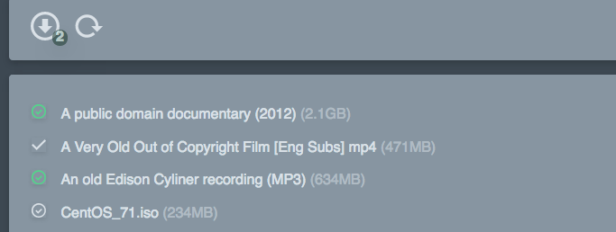

# Transcopy

*NOTE* this is a work in progress and very much a 'scratch my own itch' project.

A very bare-bones web app which lets me copy files from my raspberry pi to my little PVR/media box.  My rpi runs a [transmission daemon](http://www.techjawab.com/2014/08/how-to-install-transmission-on.html) to download *entirely legitimate* torrents.  I then copy them to another pi which is running kodi (libreElec) to watch as streaming them can be a little annoying.  I was getting a bit fed up ssh'ing to the pi and running a script which copied files, so thought it would be easier to write a little web app so I could kick off the copying from my phone (or whatever) while I'm slumped on the sofa.



## What it does

It will show you a list of torrents (via the Transmission daemon).  You can pick some of those and kick off a series of queued background jobs which will copy those files to another directory (eg, a samba share).  It does them one at a time as doing multiple files at once seems to make my poor rpi wifi fall over.  It can also send you notification emails when the files have copied.

It's somewhat of an SPA (single page app) in that it'll show live progress of downloading files, copying status etc. It uses
Vue.js to handle most of that.

## Installation

Assuming you have PHPv7 and [composer](https://getcomposer.org/) installed.

Clone the project, then run (in the project directory) :

* `composer install`
* `cp .env.example .env`
* `php artisan key:generate`
* `touch database/database.sqlite`
* `php artisan migrate`

Now edit the `.env` file to fill in the values that match your system setup (eg, mail notification address, path to your files/torrents).

Then edit `config/filesystems.php` - the default is set to use [minio](https://minio.io/) on your remote server (which is what I have going).  If you are just mounting your remote/kodi box via samba then comment out the current 'destination' entry and comment in the one with the 'driver' set to 'local'.

In theory you are now good to go.

## Running

You should really [set up apache](https://blog.mythic-beasts.com/2017/03/22/php7-on-a-raspberry-pi-3-in-the-cloud/) or nginx to serve the app.  That's beyond of the scope of these docs, but if you install apache2+php7 on your rpi, then at the very least in the `/etc/apache2/sites-available/000-default.conf` you can set

 `DocumentRoot /var/www/html/transcopy/public`

option and something like :

```
<Directory /var/www/html/transcopy>
	Options Indexes FollowSymLinks
	AllowOverride All
	Require all granted
</Directory>
```

To process the background copy jobs just run `php artisan queue:work --tries=1 --timeout=0`. You can add a systemd entry to keep that going all the time - something like :

```
# in /lib/systemd/system/transcopy.service
[Unit]
Description=Queue worker for transcopy
After=network.target auditd.service

[Service]
ExecStart=/usr/bin/php /var/www/html/transcopy/artisan queue:work --tries=1 --timeout=0 --daemon
Restart=always

[Install]
WantedBy=multi-user.target
```

Then run `systemctl enable transcopy.service` and `systemctl start transcopy`.

Now you should be able to point your browser to `http://your-rpi-ip-address/` and see the default page.  Click the 'refresh' button to get the up-to-date list of torrents from the transmission daemon.

## Copying torrents which are still downloading

If you want to be able to mark torrents which are still downloading so that they will
automatically be copied once they're finished, then just add a cron entry to your
system like this :

```
* * * * * /usr/bin/php /path-to-transcopy/artisan schedule:run >> /dev/null 2>&1
```

Then when you click a torrent which is still downloading and then the 'download' button,
the system will check for it finishing every five minutes - once it's done it will
be added to the queue and copied as normal.
